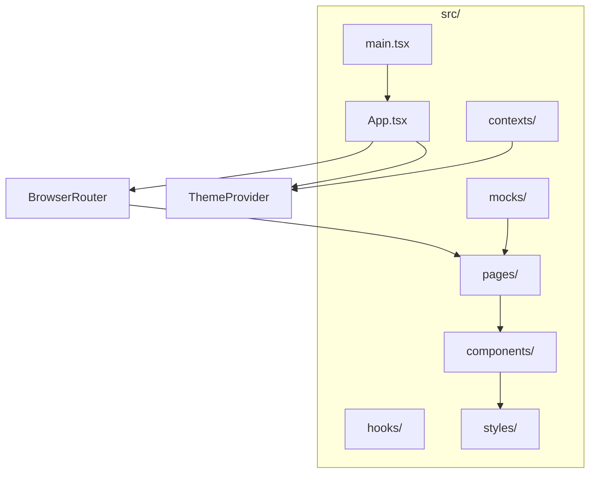

# Plano: Sistema de Visualizador de Arquivos (File Explorer)

## Visão Geral da Arquitetura




## 1. Dependências (Yarn)

Instalar via Yarn:

- `react-router-dom` - Sistema de rotas
- `styled-components` - Estilização
- `@types/styled-components` - Tipos TypeScript
- `react-icons` - Ícones por tipo de arquivo (FaFileExcel, FaFilePdf, FaFileCsv, etc.)

## 2. Estrutura de Pastas

```
src/
├── components/           # Componentes genéricos (sem lógica de negócio)
│   ├── Button/
│   │   ├── Button.tsx
│   │   └── Button.styles.ts
│   ├── FileIcon/
│   ├── FileCard/
│   ├── FileList/
│   ├── Header/
│   ├── ThemeToggle/
│   └── index.ts
├── pages/
│   ├── FileExplorerPage/
│   │   ├── FileExplorerPage.tsx
│   │   └── FileExplorerPage.styles.ts
│   └── index.ts
├── contexts/
│   └── ThemeContext.tsx
├── hooks/
│   └── useTheme.ts
├── mocks/
│   └── files.ts
├── styles/
│   └── theme/
│       ├── index.ts
│       ├── colors.ts
│       ├── borderRadius.ts
│       ├── fontWeight.ts
│       ├── fontSize.ts
│       └── spacing.ts
├── types/
│   └── file.ts
├── App.tsx
└── main.tsx
```

## 3. Sistema de Tema (styles/theme)

Cada token em arquivo separado:


| Arquivo                                                          | Conteúdo                                                       |
| ---------------------------------------------------------------- | -------------------------------------------------------------- |
| [styles/theme/colors.ts](src/styles/theme/colors.ts)             | Paletas light/dark: background, surface, text, primary, accent |
| [styles/theme/borderRadius.ts](src/styles/theme/borderRadius.ts) | sm, md, lg, full                                               |
| [styles/theme/fontWeight.ts](src/styles/theme/fontWeight.ts)     | regular, medium, semibold, bold                                |
| [styles/theme/fontSize.ts](src/styles/theme/fontSize.ts)         | xs, sm, md, lg, xl                                             |
| [styles/theme/spacing.ts](src/styles/theme/spacing.ts)           | xs, sm, md, lg, xl                                             |


O `index.ts` exporta um objeto `theme` com light/dark e um tipo `Theme` para styled-components.

## 4. Dados do Arquivo (Mock)

Interface em [types/file.ts](src/types/file.ts):

```typescript
interface FileItem {
  id: string;
  name: string;
  extension: string;
  size: number;        // bytes
  type: string;        // MIME type
  createdAt: string;
  modifiedAt: string;
  path: string;
}
```

Mock em [mocks/files.ts](src/mocks/files.ts) com exemplos: Excel (.xlsx), CSV (.csv), PDF (.pdf), Word (.docx), imagens (.png, .jpg), etc.

## 5. Mapeamento de Ícones por Extensão

Usar `react-icons/fa` para mapear extensões:

- `.xlsx`, `.xls` → FaFileExcel
- `.csv` → FaFileCsv
- `.pdf` → FaFilePdf
- `.docx`, `.doc` → FaFileWord
- `.png`, `.jpg`, `.jpeg`, `.gif` → FaFileImage
- `.mp4`, `.avi` → FaFileVideo
- `.mp3`, `.wav` → FaFileAudio
- `.zip`, `.rar` → FaFileArchive
- default → FaFile

Lógica em `FileIcon` ou em um utilitário `utils/fileIcons.ts`.

## 6. Componentes Genéricos


| Componente      | Responsabilidade                                                |
| --------------- | --------------------------------------------------------------- |
| **Button**      | Botão reutilizável (variantes: primary, secondary, ghost)       |
| **FileIcon**    | Recebe `extension` e renderiza ícone correspondente             |
| **FileCard**    | Card com nome, tamanho, tipo, data; recebe `file` como prop     |
| **FileList**    | Lista de FileCard; recebe `files` e opcionalmente `onFileClick` |
| **Header**      | Cabeçalho com título e slot para ações (ex: ThemeToggle)        |
| **ThemeToggle** | Switch/botão para alternar dark/light mode                      |


Regra: componentes em `components/` não fazem fetch, não conhecem rotas nem mocks; recebem dados via props.

## 7. Páginas

- **FileExplorerPage**: usa mock de arquivos, renderiza Header + FileList, passa dados para os componentes.
- Rota principal: `/` ou `/explorer` apontando para FileExplorerPage.

## 8. Rotas (React Router)

Em [App.tsx](src/App.tsx):

```tsx
<BrowserRouter>
  <Routes>
    <Route path="/" element={<FileExplorerPage />} />
  </Routes>
</BrowserRouter>
```

## 9. Dark/Light Mode

- `ThemeContext` com `theme` (light/dark) e `toggleTheme`.
- `ThemeProvider` envolvendo a árvore.
- styled-components usando `ThemeProvider` do styled com o tema atual.
- `ThemeToggle` consome o context e alterna o tema.
- Persistir preferência em `localStorage` (opcional, recomendado).

## 10. Padrão JSX vs Estilos

- Cada componente em pasta própria: `ComponentName.tsx` (JSX) e `ComponentName.styles.ts` (styled-components).
- Estilos importados no `.tsx` e usados como componentes.

Exemplo:

```tsx
// Button.tsx
import * as S from './Button.styles';
export const Button = ({ children, ...props }) => <S.Button {...props}>{children}</S.Button>;
```

```ts
// Button.styles.ts
import styled from 'styled-components';
export const Button = styled.button`...`;
```

## 11. Regras do Cursor (.cursor/rules/)

Criar regras **genéricas** (não específicas do file explorer):


| Arquivo                 | Conteúdo                                                                                      |
| ----------------------- | --------------------------------------------------------------------------------------------- |
| `project-structure.mdc` | Estrutura de pastas (components, pages, hooks, contexts, styles/theme), separação JSX/estilos |
| `styled-components.mdc` | Uso de styled-components, arquivos `.styles.ts` separados                                     |
| `theme-system.mdc`      | Organização do tema em colors, borderRadius, fontWeight, fontSize, spacing                    |
| `react-patterns.mdc`    | Componentes genéricos em components/, lógica em pages/hooks                                   |


Formato conforme [create-rule SKILL](.cursor/skills-cursor/create-rule/SKILL.md): frontmatter com `description`, `globs` ou `alwaysApply: true`.

## 12. Interface Visual

- Layout: header fixo + área de conteúdo com grid ou lista de cards.
- Cards de arquivo: ícone à esquerda, nome, extensão, tamanho formatado (KB/MB), data de modificação.
- Cores e espaçamentos vindos do tema.
- Transição suave ao trocar dark/light.
- Tipografia legível e hierarquia clara (título, subtítulo, corpo).

## Ordem de Implementação Sugerida

1. Instalar dependências (yarn)
2. Criar estrutura de tema (styles/theme)
3. Criar ThemeContext e ThemeProvider
4. Criar tipos e mock de arquivos
5. Criar utilitário de ícones por extensão
6. Criar componentes genéricos (Button, FileIcon, FileCard, FileList, Header, ThemeToggle)
7. Criar FileExplorerPage
8. Configurar React Router no App
9. Ajustar main.tsx (ThemeProvider, remover estilos antigos)
10. Criar regras do Cursor em .cursor/rules/

