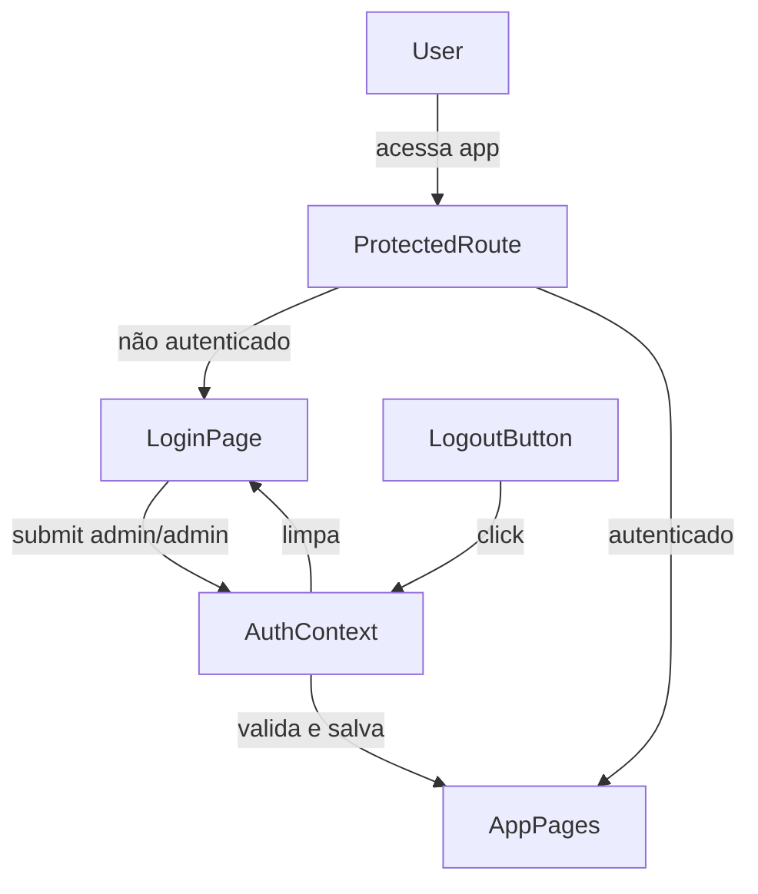
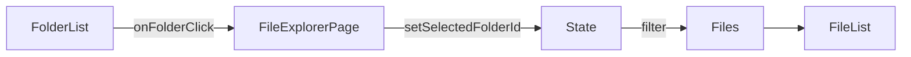

# Plano: Login e Navegação por Pastas

## 1. Sistema de Login

### 1.1 AuthContext e AuthProvider

- Estado: `user`, `isAuthenticated`, `isLoading`
- Funções: `login(username, password)`, `logout()`
- Validação: credenciais fixas `admin` / `admin`
- Persistência: `localStorage` com chave `storagefy-auth`

### 1.2 Tela de Login

- Formulário com usuário e senha
- Credenciais de demonstração: admin / admin
- Layout centralizado com styled-components

### 1.3 Rotas Protegidas

- ProtectedRoute: se autenticado renderiza Outlet, senão redireciona para `/login`

### 1.4 Botão de Logout

- LogoutButton no Header, junto ao ThemeToggle

## 2. Navegação por Pastas

### 2.1 Estrutura de Dados

- `folderId` em FileItem
- Pasta "Todos" (id `root`)
- Mocks associando arquivos a pastas

### 2.2 Lógica na FileExplorerPage

- Estado `selectedFolderId`
- Filtrar arquivos por pasta selecionada
- Destaque visual no FolderCard

## Fluxo de Autenticação

## Fluxo de Navegação por Pastas

## Ordem de Implementação

1. AuthContext e AuthProvider
2. LoginPage
3. ProtectedRoute
4. Integração no App
5. LogoutButton
6. Tipos e mocks (folderId)
7. Filtro e clique em pasta
8. Destaque visual no FolderCard
