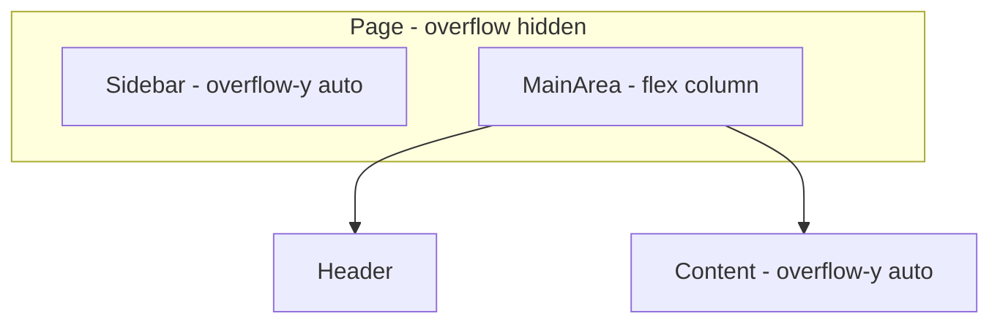

# Plano: Responsividade Mobile e Sistema de Scroll

## 1. Breakpoints e Tema

- Criar `styles/theme/breakpoints.ts` (mobile: 480px, tablet: 768px, desktop: 1024px)

## 2. Scrollbar Customizada

- Criar `styles/scrollbar.ts` com createGlobalStyle
- Classes: `.sidebar-scroll`, `.main-content-scroll`, `.drawer-scroll`

## 3. Scroll Isolado

- Page: `height: 100dvh`, `overflow: hidden`, `display: flex`
- MainArea: `flex: 1`, `min-height: 0`, `overflow: hidden`
- Content: `flex: 1`, `min-height: 0`, `overflow-y: auto`
- Sidebar: `overflow-y: auto` próprio

## 4. Sidebar Mobile (Drawer)

- **Desktop (>= 768px)**: Sidebar fixa à esquerda
- **Mobile (< 768px)**: Drawer com overlay, abre ao clicar no hamburger
- HamburgerButton no Header
- Overlay fecha ao clicar

## 5. Botão Flutuante (FAB)

- FloatingUploadButton: circular, fixo no centro inferior
- Visível apenas em mobile
- UploadButton do header oculto em mobile

## 6. Ajustes Responsivos

- Header: padding e font-size menores em mobile
- FileExplorerPage: padding reduzido, grid com minmax menor
- Drawers: width 100% em mobile

## 7. Fluxo de Scroll

## Ordem de Implementação

1. Breakpoints ao tema
2. Scrollbar global
3. MainLayout e Sidebar (scroll isolado)
4. useMediaQuery hook
5. HamburgerButton e drawer no Sidebar
6. FloatingUploadButton
7. Ajustes responsivos
8. Drawers para mobile
